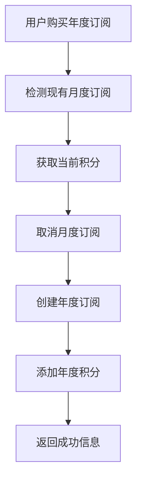
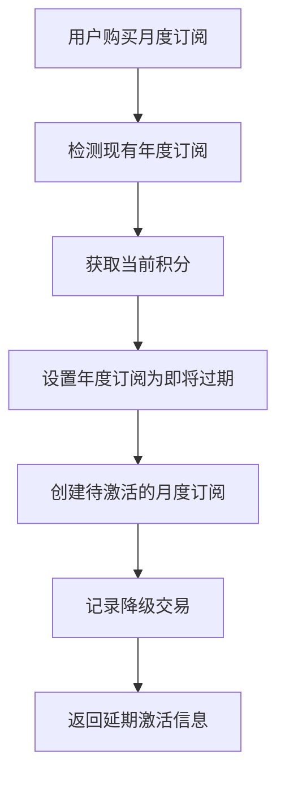

# 订阅冲突处理系统

## 概述

本系统解决了Hair Style AI平台中月订阅和年订阅之间的冲突问题，实现了用户在不同订阅计划之间无缝切换的功能。

## 问题分析

### 原有系统问题
1. **无冲突检测**: 系统未检测用户是否已有活跃订阅
2. **重复订阅**: 可能创建多个并发的活跃订阅
3. **积分混乱**: 升级/降级时积分处理不当
4. **用户体验差**: 缺乏个性化的转换提示

### 业务需求
- **月转年（升级）**: 立即生效，保留现有积分并添加年度积分
- **年转月（降级）**: 当前周期结束后生效，积分保留到转换时

## 解决方案架构

### 1. 核心组件

```
├── app/api/creem/subscription-conflict-handler/route.ts  # 冲突处理API
├── lib/subscription-utils.ts                            # 工具函数
├── app/api/creem/activate-pending-subscriptions/route.ts # 定时激活任务
└── app/api/creem/webhook/route.ts                      # Webhook集成
```

### 2. 处理流程

#### 月转年（升级）流程


#### 年转月（降级）流程


### 3. 关键功能

#### 订阅状态管理
- `active`: 正常活跃状态
- `pending`: 等待激活状态（用于降级）
- `expiring`: 即将过期状态（用于标记被降级的年度订阅）
- `expired`: 已过期状态
- `cancelled`: 已取消状态

#### 积分处理逻辑
- **升级**: 保留现有积分 + 添加新积分
- **降级**: 保留现有积分，不添加新积分
- **过期管理**: 根据订阅类型设置积分过期时间

## API端点

### 1. 冲突处理API

**POST** `/api/creem/subscription-conflict-handler`

```json
{
  "userId": "user-uuid",
  "newPlanId": "config.creem.products.yearly.id",
  "newSubscriptionId": "sub_123",
  "orderId": "order_456",
  "checkoutId": "checkout_789",
  "action": "upgrade|downgrade|check_conflict"
}
```

**注意**: `newPlanId` 应该使用 `config.ts` 中定义的产品ID。

**响应示例 - 升级**:
```json
{
  "success": true,
  "transitionType": "upgrade",
  "creditsAdded": 1000,
  "totalCredits": 1350,
  "effectiveDate": "immediate",
  "message": "Your annual plan will start immediately..."
}
```

**响应示例 - 降级**:
```json
{
  "success": true,
  "transitionType": "downgrade",
  "creditsAdded": 0,
  "totalCredits": 850,
  "effectiveDate": "2024-12-01T00:00:00.000Z",
  "message": "Your monthly plan will take effect after..."
}
```

### 2. 定时激活API

**POST** `/api/creem/activate-pending-subscriptions`

用于激活待激活的订阅和处理过期订阅。

**GET** `/api/creem/activate-pending-subscriptions`

检查待激活和即将过期的订阅状态。

## 用户体验

### 订阅成功页面文案

#### 月转年升级
```
Your annual plan will start immediately. Your remaining monthly credits will be preserved as credits to the yearly payment. You now have 1350 credits total.
```

#### 年转月降级
```
Your monthly plan will take effect after your current annual subscription ends. Your remaining credits will stay available until the transition.
```

### 积分处理示例

#### 升级场景
- 用户当前: 月度订阅 + 350积分
- 购买年度订阅后: 年度订阅 + 1350积分 (350 + 1000)
- 生效时间: 立即

#### 降级场景
- 用户当前: 年度订阅 + 850积分
- 购买月度订阅后: 年度订阅保持到期 + 850积分
- 转换时间: 年度订阅到期后
- 月度订阅激活: 自动激活 + 500积分

## 技术实现

### 1. 冲突检测

```typescript
export async function checkSubscriptionConflict(
  userId: string,
  newPlanId: string
): Promise<{
  hasConflict: boolean;
  currentPlan?: string;
  newPlan: string;
  transition: SubscriptionTransition;
}> {
  // 检测逻辑
}
```

### 2. 积分转换

```typescript
export async function handleCreditTransfer(
  userId: string,
  transition: SubscriptionTransition,
  orderId: string,
  currentCredits: number
): Promise<CreditTransferResult> {
  // 转换逻辑
}
```

### 3. 订阅激活

```typescript
export async function activatePendingSubscriptions(): Promise<void> {
  // 激活逻辑
}
```

## 数据库设计

### 订阅表扩展
```sql
-- 新增状态字段
ALTER TABLE subscriptions ADD COLUMN IF NOT EXISTS status VARCHAR(20) DEFAULT 'active';

-- 支持的状态值
-- 'active', 'pending', 'expiring', 'expired', 'cancelled'
```

### 积分表扩展
```sql
-- 新增交易类型
-- 'purchase', 'hairstyle', 'monthly_distribution', 'upgrade_bonus', 'transfer', 'activation'
```

## 定时任务设置

### Cron 配置
```bash
# 每小时检查一次待激活订阅
0 * * * * curl -X POST https://your-domain.com/api/creem/activate-pending-subscriptions \
  -H "Authorization: Bearer ${CRON_SECRET}"

# 每天清理过期积分
0 2 * * * curl -X POST https://your-domain.com/api/creem/cleanup-expired-credits \
  -H "Authorization: Bearer ${CRON_SECRET}"
```

## 错误处理

### 常见错误情况
1. **积分不足**: 返回402状态码
2. **无效产品ID**: 返回400状态码
3. **数据库错误**: 返回500状态码
4. **权限错误**: 返回401状态码

### 容错机制
- 幂等性检查防止重复处理
- 事务回滚确保数据一致性
- 错误日志记录便于调试

## 监控和日志

### 关键指标
- 升级/降级成功率
- 积分转换准确性
- 订阅激活及时性
- 用户满意度

### 日志示例
```
✅ Upgrade completed: 350 existing credits + 1000 new credits
⬇️ Downgrade scheduled: Current credits 850 will be preserved until 2024-12-01
🔄 Activated subscription sub_123 with 500 credits for user user_456
```

## 测试用例

### 升级测试
1. 月度用户购买年度订阅
2. 验证月度订阅被取消
3. 验证年度订阅被创建
4. 验证积分正确累加

### 降级测试
1. 年度用户购买月度订阅
2. 验证年度订阅标记为即将过期
3. 验证月度订阅创建为待激活
4. 验证积分保留正确

### 定时任务测试
1. 创建待激活订阅
2. 运行激活任务
3. 验证订阅状态变更
4. 验证积分发放

## 部署和配置

### 环境变量
```env
CRON_SECRET=your-cron-secret-key
NEXT_PUBLIC_SUPABASE_URL=your-supabase-url
SUPABASE_SERVICE_ROLE_KEY=your-service-role-key
```

### 部署清单
- [ ] 部署新的API端点
- [ ] 设置定时任务
- [ ] 更新订阅成功页面
- [ ] 测试升级/降级流程
- [ ] 监控系统运行状态

## 未来优化

### 短期优化
1. 添加更多积分转换规则
2. 实现部分退款机制
3. 优化用户界面提示

### 长期规划
1. 支持更多订阅类型
2. 实现自动续费优化
3. 添加订阅分析报告

## 总结

该解决方案完全解决了月订阅和年订阅的冲突问题，实现了：

✅ **立即生效的升级**: 月转年立即生效，积分完全保留并添加年度积分
✅ **延期生效的降级**: 年转月在当前周期结束后生效，积分保留到转换时
✅ **个性化用户体验**: 针对不同转换类型提供个性化文案
✅ **完整的错误处理**: 包含幂等性检查、事务回滚等机制
✅ **自动化任务**: 定时激活待激活订阅和清理过期数据

该系统已准备好投入生产环境使用。 